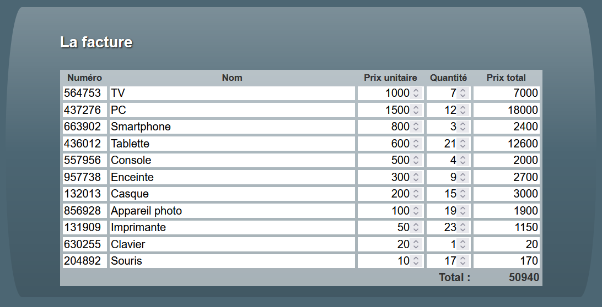

### Choix de projet : Achat en ligne (AchatArticle.vue)

Ce component est voué à être utilisé par un autre component. Il n'affiche qu'__un__ produit. Mais si on l'utilise plusieurs fois, on peut afficher une facture complète comme dans l'exemple.

> ATTENTION! __Votre__ component ne doit pas afficher la facture complète. Il doit seulement afficher un produit. C'est le component parent qui doit s'occuper de l'affichage de la facture complète. Vous n'avez pas à créer la facture au complet.

#### Affichage
Le component doit présenter un élément `fieldset` qui contient :
   - Un élément `input` qui contient le numero du produit (readonly).
   - Un élément `input` qui contient le nom du produit (readonly).
   - Un élément `input` qui contient le prix du produit.
   - Un élément `input` qui contient la quantité du produit.
   - Un élément `input` qui contient le prix total du produit (readonly).

#### Les props (ce qu'il reçoit)
Le component peut recevoir à votre choix :
1. Soit __un__ tableau d'__objets__ qui contient les informations sur le produit.
2. Soit __cinq__ props individuelles.

#### À quoi il réagit
Lorsque le prix ou la quantité change, le component doit mettre à jour le prix total du produit.

#### Ce qu'il émet
Le component parent n'a pas besoin de s'en servir, mais le component doit émettre un événement lorsqu'il change de publicité. L'événement doit envoyer le nouveau total.

#### Ce que je fournis
Rien.

# Le contenu

Rien, j'ai dit !
