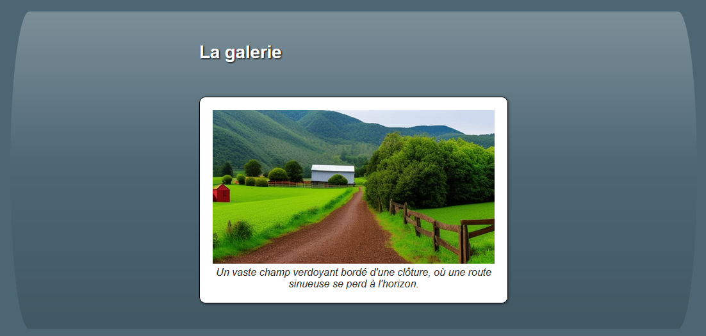

# Choix de projet : Galerie d'images (Galerie.vue)
De jolies photos pour votre site web. Ce component affiche une image et sa description. cette image change quand on clique dessus.

## Affichage
Le component doit présenter l'image et sa description dans un élément `figure`. L'image doit être dans un élément `img` et la description dans un élément `figcaption`. L'image doit être centrée. La description doit être en dessous de l'image et centrée.

## Les props (ce qu'il reçoit)
Le component peut recevoir à votre choix :
1. Soit __un__ tableau d'__objets__ qui contient les informations sur les images à afficher, soit son `src` et sa `description`.
1. Soit __deux__ tableaux de __chaines de caractères__, un pour les `src` et un pour les `description`.
La première option est plus robuste et devrait être favorisée.

## À quoi il réagit
Lorsque l'utilisateur clique sur l'image, le component doit afficher à votre choix : 
   - l'image suivante. Si l'image affichée est la dernière de la liste, le component doit afficher la première image de la liste.
   - une image aléatoire.

## Ce qu'il émet
Le component parent n'a pas besoin de s'en servir, mais le component doit émettre un événement lorsqu'il change d'image. L'événement doit envoyer contenir au minimum le `src` de la nouvelle image.

## Ce que je fournis
Vous n'êtes pas oubligé de vous en servir, mais je fournis une liste d'images et de descriptions.

## Le contenu

| src                             | description                                                                                                                                                       |
| ------------------------------- | ----------------------------------------------------------------------------------------------------------------------------------------------------------------- |
| le-rang.jpg                     | Un vaste champ verdoyant bordé d'une clôture, où une route sinueuse se perd à l'horizon.                                                                          |
| champ-de-lavande.jpg            | Un étendue verdoyante éclatante, abondamment fleurie de magnifiques lavandes colorées, créant un spectacle enchanteur.                                            |
| le-lac.jpg                      | Une rivière majestueuse serpentant à travers un paysage montagneux, offrant une vue pittoresque où les arbres se reflètent gracieusement à la surface de l'eau.   |
| des-montagnes-et-des-nuages.jpg | Une chaîne de montagnes majestueuses se dressant fièrement sous un ciel nuageux, créant un paysage mystérieux et captivant.                                       |
| le-bord-de-la-mer.jpg           | Une vue enchanteresse sur une plage, où une profusion de plantes verdoyantes ajoute une touche de fraîcheur et de vie à cet endroit paradisiaque.                 |
| sur-mars.jpg                    | Un désert extraterrestre parsemé de quelques rochers et arbres, évoquant une ambiance unique et intrigante, telle une scène tirée d'un monde inconnu.             |
| sur-la-lune.jpg                 | Un cerf-volant flottant gracieusement dans le ciel, au-dessus d'un désert lunaire, créant une image poétique et surréaliste, comme un rêve éveillé.               |
| une-ferme-en-montagne.jpg       | Un paysage montagneux à couper le souffle, où une ferme isolée se dresse vaillamment parmi les sommets, offrant une harmonie parfaite entre l'homme et la nature. |
